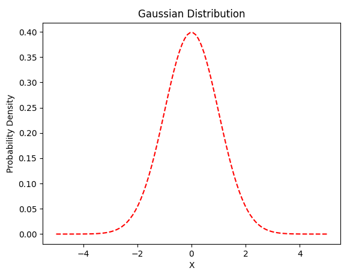
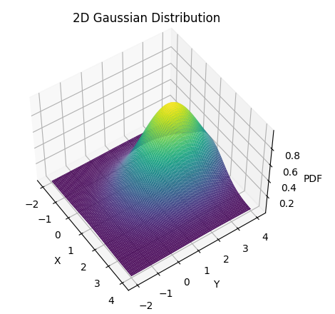

# A repository on how to understand the theory of 3D Gaussians Splatting

Another comprehensive repository, you might need it：[awesome-3D-gaussian-splatting](https://github.com/MrNeRF/awesome-3D-gaussian-splatting)

coming soon:
>- A theoretical derivation about 3D Gaussian Splatting Rasterization will be added soon...

## Theoretical derivation：

First, let's start by understanding the standard unit Gaussian function, which represents a function with a mean of $\mu$ and a variance of $\sigma$ equal to 1, where the sum of its probability density is 1：
$$f(x) = \frac{1}{\sqrt{2π}}e^{-\frac{x^2}{2}} \tag{1}$$



Now, we do not constrain the mean and variance and express them in a general form:

$$f(x) = \frac{1}{\sqrt{2π}σ}e^{-\frac{(x-μ)^2}{2σ^{2}}} \tag{2}$$

Here, $\sigma$ represents the variance of the Gaussian function, and $\mu$ represents the mean. Mathematically, it means shifting the standard Gaussian function to the right by $\mu$ units, stretching the function's width by a factor of $\sigma$. In order to ensure that the probability density function integrates to 1, the height of $f(x)$ decreases, which is reflected in dividing the denominator by $\sigma$.

We consider $n$ independent variables, each following a normal distribution and being mutually uncorrelated, represented as :

$$x = \left[ \begin{matrix} x_{1}, x_{2},\cdots,x_{n}\end{matrix}\right]^\mathrm{T}$$

with a mean of :

$$E(x) = \left[ \begin{matrix} μ_{1}, μ_{2},\cdots,μ_{n}\end{matrix}\right]^\mathrm{T}$$

and a variance of: 

$$σ(x) = \left[ \begin{matrix} σ_{1}, σ_{2},\cdots,σ_{n}\end{matrix}\right]^\mathrm{T}$$

In this case, according to the probability density formula in probability theory, we have:

$$f(x) = p(x_{1},x_{2}....x_{n}) = p(x_{1})p(x_{2})....p(x_{n}) = \frac{1}{(\sqrt{2π})^nσ_{1}σ_{2}\cdotsσ_{n}}e^{-\frac{(x_{1}-μ_{1})^2}{2σ_{1}^2}-\frac{(x_{2}-μ_{2})^2}{2σ_{2}^2}\cdots-\frac{(x_{n}-μ_{n})^2}{2σ_{n}^2}} \tag{3}$$

We let $z^{2} = \frac{(x_{1}-μ_{1})^2}{σ_{1}^2}+\frac{(x_{2}-μ_{2})^2}{σ_{2}^2}\cdots+\frac{(x_{n}-μ_{n})^2}{σ_{n}^2}$， $σ_{z}= σ_{1}σ_{2}\cdotsσ_{n}$ ，We can simplify the above multivariate normal distribution Gaussian function as:
$$f(z) = \frac{1}{(\sqrt{2π})^nσ_{z}}e^{-\frac{z^2}{2}} \tag{4}$$

And $z^2$ can be represented as $z^\mathrm{T}z$, decomposed into vector notation:

$$z^2 = z^\mathrm{T}z = \left[ \begin{array}{cccc} x_{1} - μ_{1} & x_{2} - μ_{2} & \cdots & x_{n} - μ_{n} \end{array} \right] \left[ \begin{array}{cccc} \frac{1}{σ_{1}^2} & 0 & \cdots & 0 \\
0 & \frac{1}{σ_{2}^2} & \cdots & 0 \\
\vdots & \cdots & \cdots & \vdots \\
0 & 0 & \cdots & \frac{1}{σ_{n}^2} \end{array} \right] \left[ \begin{array}{c} x_{1} - μ_{1} \\ x_{2} - μ_{2} \\ \vdots \\ x_{n} - μ_{n} \end{array} \right]^\mathrm{T} \tag{5}$$


$x - μ_{x}$ can be represented as $x - μ_{x} = \left[ \begin{matrix} x_{1} - μ_{1}, x_{2} - μ_{2}, \cdots,x_{n} - μ_{n} \end{matrix}\right]^\mathrm{T}$ , and at this point, $z^2$ can be represented as:

$$[x - μ_{x}]^\mathrm{T}\left[ \begin{matrix} \frac{1}{σ_{1}^2}&0&\cdots&0 \\ 
0&\frac{1}{σ_{2}^2}&\cdots&0 \\ 
\vdots&\cdots&\cdots&\vdots \\ 
0&0&\cdots&\frac{1}{σ_{n}^2}  \end{matrix}\right][x - μ_{x}] \tag{6}$$

Mathematically, the covariance matrix $Σ$ is defined as, with its diagonal elements equal to the covariance between $x_i$ and $x_j$:

$$∑_{}^{} = \left[ \begin{matrix} σ_{1}^2&0&\cdots&0 \\ 
0&σ_{2}^2&\cdots&0 \\ 
\vdots&\cdots&\cdots&\vdots \\ 
0&0&\cdots&σ_{n}^2  \end{matrix}\right] \tag{7}$$

At this point, the variables are independent, so only diagonal elements exist, and these elements represent the covariance between $x_i$ and itself, which is also equal to the variance $\sigma^2$. $Σ$ is a diagonal matrix, and its inverse matrix is:

$$( (∑_{}^{})^{-1} = \left[ \begin{matrix} \frac{1}{σ_{1}^2}&0&\cdots&0 \\ 
0&\frac{1}{σ_{2}^2}&\cdots&0 \\ 
\vdots&\cdots&\cdots&\vdots \\ 
0&0&\cdots&\frac{1}{σ_{n}^2}  \end{matrix}\right] \tag{8}$$

Its determinant is：

$$\left|∑_{}^{}\right| =σ_{1}^2σ_{2}^2.....σ_{n}^2 \tag{9}$$

$$σ_{z}= \left|∑_{}^{}\right|^\frac{1}{2} =σ_{1}σ_{2}.....σ_{n} \tag{10}$$

At this point, we can simplify Equation (5) to：

$$z^\mathrm{T}z = (x - μ_{x})^\mathrm{T}  \sum_{}{}^{-1} (x - μ_{x}) \tag{11}$$

Substitute this into the multivariate normal Gaussian distribution function (4) with $z$ as the independent variable:

$$f(z) = \frac{1}{(\sqrt{2π})^nσ_{z}}e^{-\frac{z^2}{2}} = \frac{1}{(\sqrt{2π})^{n}\left|∑_{}^{}\right|^\frac{1}{2}}e^{-\frac{ (x\  -\  μ_{x})^\mathrm{T}\  (\sum_{}{})^{-1}\  (x\  -\  μ_{x})}{2}} \tag{12}$$

In the 3D Gaussian Splatting paper, the authors define the multivariate Gaussian function in world space using a 3D covariance matrix (refer to Equation 12, where the paper's Equation 4 omits $u$ and the preceding coefficients):

$$G(x) = e^{-\frac{ (x\  -\  μ)^\mathrm{T}\  (\sum_{}{})^{-1}\  (x\  -\  μ)}{2}} \tag{13}$$

In the context of the 3D Gaussian Splatting paper, this 3D Gaussian is one of the optimization targets (parameters $u$ and $Σ$), corresponding to the 3D Gaussian position and anisotropic covariance. It represents a 3D Gaussian function with the center at $u$ and variances in the x, y, and z directions equal to the diagonal elements of $Σ$. To visually understand this, here we use Python to draw a 2D Gaussian with the center at (1, 2) and a covariance matrix of [[1, 0], [0, 2]] (the vertical axis represents the probability density with $u$ and $Σ$ substituted).



In order to complete the process of rasterization from 3D to 2D images after obtaining the 3D Gaussian, a transformation matrix from world to camera space, denoted as $W$, and a mapping matrix from camera to screen space, denoted as $P$, are required. In the paper, the authors use $J$ to represent the Jacobian matrix of the mapping matrix $P$. At this point, the covariance matrix $\sum{'}{}$ on the 2D plane for this 3D Gaussian can be represented as:

$$\sum{'}{} = JW \sum W^\mathrm{T}J^\mathrm{T} \tag{14}$$

The covariance matrix has several important properties:

>- Symmetry: The covariance matrix is a symmetric matrix, meaning that the elements of the matrix are symmetric with respect to the main diagonal.
>- Non-Negativity: The covariance matrix is a positive semi-definite matrix, which means that its eigenvalues are non-negative.
>- The diagonal elements of the covariance matrix contain the variances of the individual variables.
>- The off-diagonal elements of the covariance matrix represent the covariances between different variables, indicating the degree of correlation between different variables.

Using the full covariance matrix introduces more parameters, and during the gradient descent optimization process, it can lead to situations where the positive semi-definite condition is not satisfied. Because the covariance matrix should be positive semi-definite, it is only necessary to consider its upper diagonal elements. Therefore, the authors decompose $Σ$ into a scaling factor $S$ (1x3) and a rotation quaternion $R$ (1x4), and then combine the scaling factor and the rotation quaternion into the upper triangular matrix of the covariance matrix (a 1x6 vector). By mirroring, a complete and positive definite $Σ$ can be obtained.

---
The process of decomposing the covariance matrix $\sum$ into scaling factors and a rotation matrix is known as the eigenvalue decomposition. This decomposition can be achieved through the following steps:
>- Calculate the eigenvalues $\lambda_{1}, \lambda_{2}, \lambda_{3}$ and the eigenvectors $v_{1}, v_{2}, v_{3}$ of the covariance matrix $\sum$.
>- Arrange the eigenvalues in descending order.
>- The scaling factors are constructed from the eigenvalues $\lambda$, with $S = \text{diag}(\lambda_{1}, \lambda_{2}, \lambda_{3})$, and the rotation matrix $R$ is constructed from the eigenvectors $v$, with $R = [v_{1}, v_{2}, v_{3}]$.

An orthogonal rotation matrix can be represented using a rotation quaternion. Assuming a quaternion $l = (w, x, y, z)$, the rotation matrix $Q$ is given by：

$$Q = \begin{bmatrix}
m_{11} & m_{12} & m_{13} \\
m_{21} & m_{22} & m_{23} \\
m_{31} & m_{32} & m_{33} \\
\end{bmatrix} \tag{15}$$

Reference《Real Time Rendering 3rd edition》：

$$\begin{aligned}m_{32}-m_{23}&=(2yz+2xw)-(2yz-2xw)=4xw \\
m_{13}-m_{31}&=(2xz+2yw)-(2xz-2yw)=4yw \\
m_{21}-m_{12}&=(2xy+2zw)-(2xy-2zw)=4zw\end{aligned} \tag{16}$$

The trace of the rotation matrix $Q$ is given by $tr(Q) = m_{11} + m_{22} + m_{33}$, and based on the equation above, it can be derived that $tr(Q) = 4w^{2} - 1$, therefore, the quaternion $l = (w,x,y,z)$ obtained from the rotation matrix $Q$ is as follows:

$$\begin{gathered} \\
w=\frac{\sqrt{(tr(Q)+1}}{2} \\
x=\frac{m_{32}-m_{23}}{4w} \\
y=\frac{m_{13}-m_{31}}{4w} \\
z=\frac{m_{21}-m_{12}}{4w} 
\end{gathered} \tag{17}$$

---

In the 3D Gaussian Splatting paper, the calculation from scaling factors $s=(a, b, c)$ and rotation quaternion $r=(w, x, y, z)$ to the covariance matrix is defined in the function `build_covariance_from_scaling_rotation()`:

```
def build_covariance_from_scaling_rotation(scaling, scaling_modifier, rotation):
    L = build_scaling_rotation(scaling_modifier * scaling, rotation)
    actual_covariance = L @ L.transpose(1, 2)
    symm = strip_symmetric(actual_covariance)

    return symm
```
Using L to represent the scaling factors：

$$L = \begin{bmatrix}
a & 0 & 0 \\
0 & b & 0 \\
0& 0 & c \\
\end{bmatrix} \tag{18}$$

Normalize the quaternion r to represent it as q：

$$l=\sqrt{w^2+x^2+y^2+z^2}$$
$$q = \frac{r}{\sqrt{w^2+x^2+y^2+z^2}} = (w',x',y',z')$$

In a left-handed coordinate system, the quaternion $(w, x, y, z)$ representing a rotation around the $w$ axis by a certain angle is transformed into a rotation matrix using the following formula, as referenced in 《3D Math Primer for Graphics and Game Development》

$$R = \begin{bmatrix}
1-2(y'^{2}+z'^{2}) & 2(x'y'-w'z') & 2(x'z'+w'y') \\
2(x'y'+w'z') & 1-2(x'^{2}+z'^{2}) & 2(y'z'-w'x') \\
2(x'z'-w'y') & 2(y'z'+w'x') & 1-2(x'^{2}+y'^{2}) \\
\end{bmatrix} \tag{19}$$

Covariance matrix

$$\sum = RL(RL)^\mathrm{T} = RLL^\mathrm{T}R^\mathrm{T} \tag{20}$$

Only the upper six elements of $Σ$ need to be retained.


Up to this point, we have learned about the relationship between the covariance matrix, scaling factors, rotation quaternion, and rotation matrix. This allows us to combine all the information in $Σ$ (with $S$ and $R$ initialized as 0 in the paper and optimized during the iteration process) to complete the rasterization process. The formula provided in the paper is as follows, replacing $L$ in Equation (19) with $S$：

$$\sum = RSS^{T}R^{T} \tag{21}$$

During the backpropagation process, it is necessary to obtain the gradients of $Σ$ with respect to the scaling factors and rotation quaternion, which are provided in the appendix of the paper.

## Reference:

>- [3D Gaussian Splatting for Real-Time Radiance Field Rendering](https://github.com/graphdeco-inria/gaussian-splatting)

>- [The Multivariate normal distribution](https://www.cnblogs.com/bingjianing/p/9117330.html)
